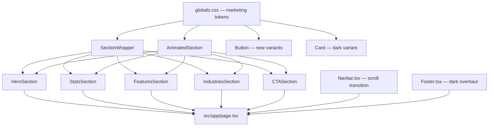

# Design Document: n8n-Style UI Overhaul

## Overview

This document describes the technical design for overhauling the CargoSignal marketing/public pages to match the visual quality and interaction style of n8n.io. The result is a dark-themed, orange-accented design system with Framer Motion scroll animations, reusable layout primitives, and zero regressions on the dashboard, auth, or superadmin areas.

The overhaul is strictly additive and isolated:
- New CSS tokens are added to `globals.css` without touching existing tokens.
- `Button` and `Card` receive new variants/props only — existing variant styles are unchanged.
- New components live in `src/components/marketing/` to avoid polluting shared UI primitives.
- No files under `src/app/dashboard/`, `src/app/superadmin/`, `src/app/login/`, `src/app/register/`, or `src/app/onboarding/` are touched.

---

## Architecture



**Data flow**: All marketing pages are static React components. No server-side data fetching is introduced. The design system tokens flow from `globals.css` → Tailwind `@theme` → component classnames.

---

## Components and Interfaces

### 1. Design System Tokens (`src/app/globals.css`)

New tokens added inside the existing `@theme` block. Existing tokens are untouched.

```css
/* Marketing-specific tokens — added to @theme */
--color-marketing-bg: #0f0f0f;
--color-marketing-accent: #ff6d00;
--color-marketing-fg: #ffffff;
--color-marketing-fg-muted: #a1a1aa;
--color-marketing-surface: #1a1a1a;
--color-marketing-border: rgba(255, 255, 255, 0.08);
```

Tailwind utility classes generated: `bg-marketing-bg`, `bg-marketing-accent`, `text-marketing-fg`, `text-marketing-fg-muted`, `bg-marketing-surface`, `border-marketing-border`.

Smooth scroll is added to the `html` selector:
```css
html { scroll-behavior: smooth; }
```

---

### 2. `SectionWrapper` (`src/components/marketing/SectionWrapper.tsx`)

```typescript
interface SectionWrapperProps {
  children: React.ReactNode;
  className?: string;       // per-section background overrides
  dark?: boolean;           // applies marketing-bg + white text
  id?: string;              // anchor link support
}
```

Renders:
```html
<section class="py-24 [dark: bg-marketing-bg text-marketing-fg] {className}">
  <div class="max-w-7xl mx-auto px-6">
    {children}
  </div>
</section>
```

---

### 3. `AnimatedSection` (`src/components/marketing/AnimatedSection.tsx`)

```typescript
interface AnimatedSectionProps {
  children: React.ReactNode;
  className?: string;
  delay?: number;           // seconds, default 0
}
```

Uses `motion.div` from `framer-motion` with:
- `initial={{ opacity: 0, y: 24 }}`
- `whileInView={{ opacity: 1, y: 0 }}`
- `viewport={{ once: true, margin: "-50px" }}`
- `transition={{ duration: 0.5, delay, ease: "easeOut" }}`

Falls back to a plain `<div>` if `framer-motion` throws (wrapped in error boundary or try/catch at module level).

---

### 4. `Button` — new variants (`src/components/ui/Button.tsx`)

Two new entries added to the `variants` map. Existing entries are unchanged.

```typescript
accent: "bg-marketing-accent text-white hover:opacity-90 active:opacity-80 rounded-ui transition-transform hover:scale-[1.02]",
"dark-outline": "border border-white/30 bg-transparent text-white hover:bg-white/10 rounded-ui transition-transform hover:scale-[1.02]",
```

The `ButtonProps` interface `variant` union is extended:
```typescript
variant?: "primary" | "secondary" | "ghost" | "outline" | "accent" | "dark-outline";
```

---

### 5. `Card` — dark variant (`src/components/ui/Card.tsx`)

A `dark` boolean prop is added to `Card`. When `true`, it applies `bg-marketing-surface border-marketing-border text-marketing-fg` instead of the default light surface classes. Default rendering is unchanged.

```typescript
interface CardProps extends React.HTMLAttributes<HTMLDivElement> {
  dark?: boolean;
}
```

---

### 6. `Navbar` — scroll transition overhaul (`src/components/layout/Navbar.tsx`)

The existing scroll listener logic is preserved. The `cn()` conditional is updated:

- Scrolled = false: `bg-transparent`
- Scrolled = true: `bg-marketing-bg/95 backdrop-blur-md shadow-sm`

Nav link active state uses `text-marketing-accent` instead of `text-brand-accent`.
The "Get Started" button uses the new `accent` variant.
Mobile dropdown panel uses `bg-marketing-bg border-marketing-border`.

---

### 7. `Footer` — dark overhaul (`src/components/layout/Footer.tsx`)

Background changed from `bg-brand-primary` to `bg-marketing-bg`. Link hover color changed to `text-marketing-accent`. Social icon hover changed to `bg-marketing-accent`. Newsletter input background changed to `bg-marketing-surface`. No structural changes.

---

### 8. Marketing Section Components (`src/components/marketing/`)

All section components accept no required props (data is inlined). They compose `SectionWrapper` and `AnimatedSection`.

| Component | File | Description |
|---|---|---|
| `HeroSection` | `HeroSection.tsx` | Dark hero with headline, CTAs, Quick Quote form |
| `StatsSection` | `StatsSection.tsx` | 4-stat grid with staggered AnimatedSection |
| `FeaturesSection` | `FeaturesSection.tsx` | 3-col service card grid |
| `IndustriesSection` | `IndustriesSection.tsx` | Dark section with 6 industry tiles |
| `CTASection` | `CTASection.tsx` | Dark CTA with headline and two buttons |

`src/app/page.tsx` is refactored to import and compose these components, replacing the current inline JSX.

---

## Data Models

No new data models are introduced. All content is static inline data within each section component. The existing mock data in `src/mock/index.ts` is not modified.

Type definitions used:

```typescript
// Used internally in section components
interface StatItem {
  label: string;
  value: string;
  icon: LucideIcon;
}

interface ServiceItem {
  title: string;
  desc: string;
  icon: LucideIcon;
}

interface IndustryItem {
  name: string;
  icon: LucideIcon;
}
```

These are defined inline within each component file (not exported to `src/types/index.ts`) since they are purely presentational.

---

## Correctness Properties

*A property is a characteristic or behavior that should hold true across all valid executions of a system — essentially, a formal statement about what the system should do. Properties serve as the bridge between human-readable specifications and machine-verifiable correctness guarantees.*

### Property 1: Navbar scroll state applies correct background class

*For any* scroll position value, when `scrolled` is `false` (position ≤ 20px) the Navbar wrapper element must have the transparent background class, and when `scrolled` is `true` (position > 20px) it must have the dark background class — never both simultaneously.

**Validates: Requirements 2.2, 2.3**

---

### Property 2: Navbar active link accent

*For any* pathname string, the nav link whose `href` matches the pathname must have the accent color class applied, and all other nav links must not have the accent color class.

**Validates: Requirements 2.5**

---

### Property 3: Navbar mobile menu visibility

*For any* `isOpen` boolean state, when `isOpen` is `true` the mobile nav panel must not have `max-h-0` or `opacity-0` applied, and when `isOpen` is `false` it must have both `max-h-0` and `opacity-0` applied.

**Validates: Requirements 2.7**

---

### Property 4: SectionWrapper dark prop applies marketing tokens

*For any* `SectionWrapper` rendered with `dark={true}`, the section element must include the `bg-marketing-bg` class and the inner content wrapper must include `text-marketing-fg` (or equivalent white text class). When `dark` is `false` or omitted, neither class must be present on the section element.

**Validates: Requirements 3.4, 3.5**

---

### Property 5: AnimatedSection transition duration is within bounds

*For any* `AnimatedSection` instance, the `transition.duration` value passed to the `motion.div` must be greater than or equal to 0.3 and less than or equal to 0.6.

**Validates: Requirements 4.3, 12.6**

---

### Property 6: AnimatedSection delay prop is forwarded

*For any* numeric `delay` value passed to `AnimatedSection`, the `transition.delay` on the underlying `motion.div` must equal that value.

**Validates: Requirements 4.5**

---

### Property 7: Button accent variant applies correct classes

*For any* `Button` rendered with `variant="accent"`, the element must have a class that applies the marketing accent background color and white text. The element must not have any class from the `primary`, `secondary`, `ghost`, or `outline` variant sets.

**Validates: Requirements 5.1**

---

### Property 8: Button dark-outline variant applies correct classes

*For any* `Button` rendered with `variant="dark-outline"`, the element must have a transparent background, a white/light border class, and white text class. The element must not have any class from the `primary`, `secondary`, `ghost`, or `outline` variant sets.

**Validates: Requirements 5.2**

---

### Property 9: Existing Button variants are unchanged

*For any* existing variant value (`"primary"`, `"secondary"`, `"ghost"`, `"outline"`), the set of classes applied by the Button component after the overhaul must be identical to the set of classes applied before the overhaul.

**Validates: Requirements 5.4, 15.4**

---

### Property 10: Staggered AnimatedSection delays are monotonically increasing

*For any* list of `AnimatedSection` components rendered as siblings (e.g., stat cards, feature cards), the `delay` prop of each item at index `i` must be strictly greater than the `delay` prop of the item at index `i-1` (i.e., delays are strictly increasing with index).

**Validates: Requirements 7.2, 8.2**

---

### Property 11: Default Card rendering is unchanged

*For any* `Card` rendered without the `dark` prop (or with `dark={false}`), the set of classes applied must be identical to the set of classes applied by the original `Card` implementation.

**Validates: Requirements 5.5, 15.5**

---

## Error Handling

| Scenario | Handling |
|---|---|
| `framer-motion` import fails at runtime | `AnimatedSection` catches the error and renders children in a plain `<div>` — no crash |
| `SectionWrapper` receives no `children` | React renders an empty section — no error |
| `Button` receives unknown `variant` | Falls back to `primary` variant via the existing default parameter |
| `AnimatedSection` receives negative `delay` | Framer Motion clamps to 0 — no visual regression |
| Missing marketing token in CSS | Tailwind falls back to `transparent`/`inherit` — no crash, minor visual degradation |

---

## Testing Strategy

### Dual Testing Approach

Both unit tests and property-based tests are required. Unit tests cover specific rendering examples and integration points. Property-based tests verify universal invariants across generated inputs.

### Unit Tests (Vitest + React Testing Library)

Focus areas:
- `SectionWrapper`: renders children, applies `py-24` and `max-w-7xl`, applies dark classes when `dark={true}`
- `AnimatedSection`: renders children, passes `viewport={{ once: true }}`, applies correct initial/animate states
- `Button`: renders all 6 variants with correct class sets, renders new `accent` and `dark-outline` variants
- `Card`: renders with and without `dark` prop, verifies default classes are unchanged
- `Navbar`: renders logo, nav links, login link, CTA button; verifies scroll state class switching; verifies active link class
- `Footer`: renders logo, quick links, support links, newsletter form; verifies dark background class
- `HeroSection`: renders headline, subheadline, two CTA buttons, Quick Quote form
- `StatsSection`: renders at least 4 stat items
- `FeaturesSection`: renders at least 6 service cards
- `IndustriesSection`: renders at least 6 industry tiles, uses `SectionWrapper` with `dark={true}`
- `CTASection`: renders headline, copy, two buttons, uses `SectionWrapper`
- `globals.css`: token values for `--color-marketing-bg`, `--color-marketing-accent`, `--color-marketing-fg`, `--color-marketing-fg-muted` match spec

### Property-Based Tests (fast-check)

`fast-check` is the chosen PBT library for TypeScript. Each test runs a minimum of 100 iterations.

**Property 1 — Navbar scroll state**
```
// Feature: n8n-style-ui-overhaul, Property 1: Navbar scroll state applies correct background class
fc.property(fc.boolean(), (scrolled) => {
  // render Navbar with mocked scrolled state
  // assert: scrolled=false → has transparent class, not dark class
  // assert: scrolled=true → has dark class, not transparent class
})
```

**Property 2 — Navbar active link**
```
// Feature: n8n-style-ui-overhaul, Property 2: Navbar active link accent
fc.property(fc.constantFrom(...navLinks.map(l => l.href)), (pathname) => {
  // render Navbar with given pathname
  // assert: exactly one link has accent class, and it matches pathname
})
```

**Property 3 — Navbar mobile menu**
```
// Feature: n8n-style-ui-overhaul, Property 3: Navbar mobile menu visibility
fc.property(fc.boolean(), (isOpen) => {
  // render Navbar with given isOpen state
  // assert: isOpen=true → panel visible; isOpen=false → panel hidden
})
```

**Property 4 — SectionWrapper dark prop**
```
// Feature: n8n-style-ui-overhaul, Property 4: SectionWrapper dark prop applies marketing tokens
fc.property(fc.boolean(), (dark) => {
  // render SectionWrapper with dark prop
  // assert: dark=true → bg-marketing-bg present; dark=false → absent
})
```

**Property 5 — AnimatedSection duration bounds**
```
// Feature: n8n-style-ui-overhaul, Property 5: AnimatedSection transition duration is within bounds
fc.property(fc.float({ min: 0, max: 10 }), (delay) => {
  // render AnimatedSection with given delay
  // assert: transition.duration is between 0.3 and 0.6 inclusive
})
```

**Property 6 — AnimatedSection delay forwarding**
```
// Feature: n8n-style-ui-overhaul, Property 6: AnimatedSection delay prop is forwarded
fc.property(fc.float({ min: 0, max: 5 }), (delay) => {
  // render AnimatedSection with delay prop
  // assert: motion.div transition.delay === delay
})
```

**Property 7 — Button accent variant classes**
```
// Feature: n8n-style-ui-overhaul, Property 7: Button accent variant applies correct classes
fc.property(fc.constant("accent"), (variant) => {
  // render Button with variant
  // assert: has marketing-accent bg class and white text class
  // assert: does not have primary/secondary/ghost/outline class sets
})
```

**Property 8 — Button dark-outline variant classes**
```
// Feature: n8n-style-ui-overhaul, Property 8: Button dark-outline variant applies correct classes
fc.property(fc.constant("dark-outline"), (variant) => {
  // render Button with variant
  // assert: has transparent bg, white border, white text
})
```

**Property 9 — Existing Button variants unchanged**
```
// Feature: n8n-style-ui-overhaul, Property 9: Existing Button variants are unchanged
fc.property(fc.constantFrom("primary", "secondary", "ghost", "outline"), (variant) => {
  // render Button with variant
  // assert: class string matches the known-good snapshot for that variant
})
```

**Property 10 — Staggered delays are monotonically increasing**
```
// Feature: n8n-style-ui-overhaul, Property 10: Staggered AnimatedSection delays are monotonically increasing
fc.property(fc.integer({ min: 2, max: 8 }), (count) => {
  // render StatsSection or FeaturesSection with `count` items
  // collect delay props from all AnimatedSection children
  // assert: delays[i] > delays[i-1] for all i > 0
})
```

**Property 11 — Default Card rendering unchanged**
```
// Feature: n8n-style-ui-overhaul, Property 11: Default Card rendering is unchanged
fc.property(fc.string(), (content) => {
  // render Card without dark prop
  // assert: class string matches original Card snapshot
})
```
